Trình duyệt Chrome là một trình duyệt yêu thích nhất của tớ, dĩ nhiên không thể không nhắc đến công cụ `Chrome Dev Tools`, một công cụ được tích hợp với mục đích chỉnh sửa các *Elements, kiểm tra lỗi, kiểm tra DOM, network,...*.

Sau đây là những thủ thuật được tớ sử dụng thường xuyên.

### 1) Chỉnh sửa chủ đề.

Không thể tránh khỏi con mắt bạn đã quen với chủ đề tối, đây là cách.

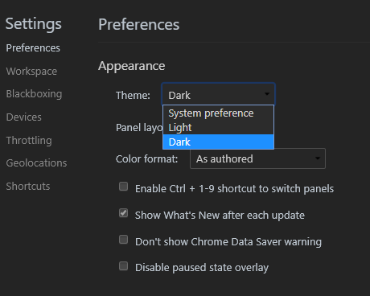

### 2) Cách xếp các bố cục Dev Tools.

Sẽ thoải mái hơn khi các layout tự động thu xếp theo một cách tự động.

Bạn có thể lựa chọn 3 cách bố cục cho bạn lựa chọn:

* horizontal;
* vertical;
* auto;

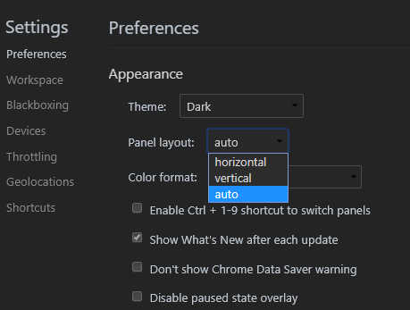

### 3) Phím tắt chuyển đổi giữa các bảng.

Sử dụng phím tắt <kbd>Ctrl</kbd> + <kbd>]</kbd> / <kbd>[</kbd> để chuyển đổi qua lại.

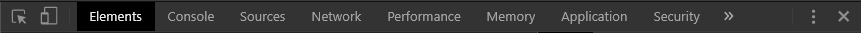

### 4) Chuyển đổi giữa các thuộc tính CSS.

Sử dụng <kbd>Tab</kbd> để nhảy đến thuộc tính tiếp theo.

Sử dụng <kbd>Shift</kbd> + <kbd>Tab</kbd> để lùi lại thuộc tính sau đó.

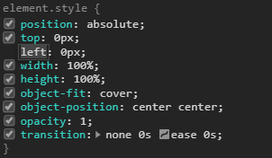

### 5) Bật tắt khả năng hiển thị của các *element*.

Bạn có thể bật tắt hiển thị các `element` bên trong DOM bằng cách nhấn phím <kbd>h</kbd> sau khi đã chọn `element` trước đó.

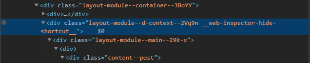

### 6) Sửa đổi thuộc tính bên trong element.

Bên trong các cây DOM, sau khi đã chọn `element` bạn cần nhấn <kbd>Enter</kbd> để tiến hành sửa đổi cách thuộc tính. Sử dụng <kbd>Tab</kbd> để tiến tới hoặc <kbd>Shift</kbd> + <kbd>Tab</kbd> để lùi về thuộc tính trước đó.

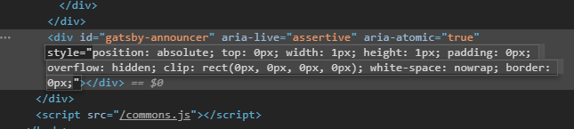

### 7) Tìm kiếm trên cây DOM.

Bạn có thể tìm kiếm bất kỳ thuộc tính, `element`, nội dung hoặc bất kỳ dạng *string* nào bên trong DOM.

Sử dụng <kbd>Ctrl</kbd> + <kbd>F</kbd> để tìm kiếm.

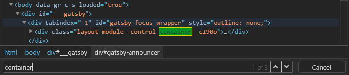

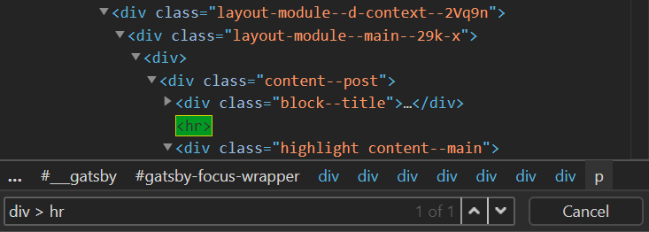

### 8) Thêm thiết bị.

Bạn có thể bật/tắt hoặc thêm thiết bị trong công cụ `Devices`.

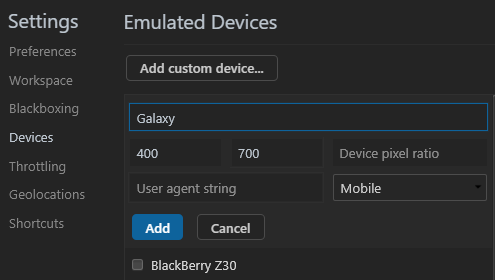

### 9) Thêm mới thuộc tính thông qua phần mở rộng.

Cách nhanh nhất để thêm một thuộc tính mới như:

* Color;
* Background color;
* Text-shadow;
* Box-shadow;

Di chuột qua biểu tượng ( ⋮ ) sau đó chọn những thuộc tính mong muốn.

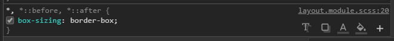

### 10) Chỉnh sửa bất kỳ nội dung nào trên trang web.

Mặc định `document.designMode = "off"`, chỉ cần đưa về giá trị **on** là bạn có thể chỉnh sửa mọi thứ.

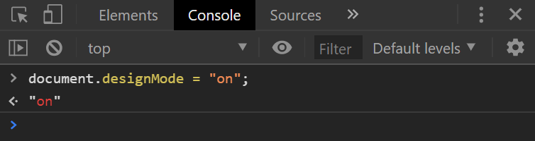

### 11) Tăng giảm các giá trị CSS.

Bạn có thể tăng giảm giá trị thông qua các phím tắt nhất định.

* Tăng giá trị lên 0.1 đơn vị <kbd>Alt</kbd> + <kbd>↑</kbd>.
* Giảm giá trị xuống 0.1 đơn vị <kbd>Alt</kbd> + <kbd>↓</kbd>.

* Tăng giá trị lên 1 đơn vị <kbd>↑</kbd>.
* Giảm giá trị xuống 1 đơn vị <kbd>↓</kbd>.

* Tăng giá trị lên 10 đơn vị <kbd>Shift</kbd> + <kbd>↑</kbd>
* Giảm giá trị xuống 10 đơn vị <kbd>Shift</kbd> + <kbd>↓</kbd>

* Tăng giá trị lên 100 đơn vị <kbd>Ctrl</kbd> + <kbd>↑</kbd>
* Giảm giá trị xuống 100 đơn vị <kbd>Ctrl</kbd> + <kbd>↓</kbd>

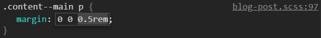

### 12) Đưa DOM element trở thành biến toàn cục.

Biến toàn cục sẽ xuất hiện ở mục `Console`.

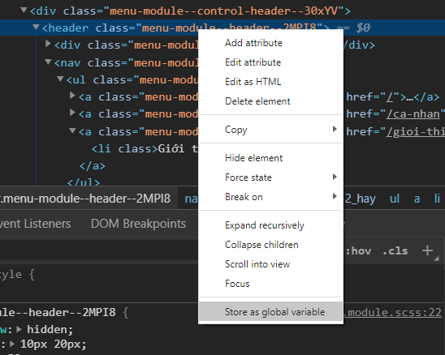

### 13) Chuyển đổi định dạng màu `rgb()` sang `HEX`, `hsl()` và ngược lại.

Bạn chỉ cần nhấn giữ phím <kbd>Shift</kbd> và chọn hộp màu ***hình vuông***.

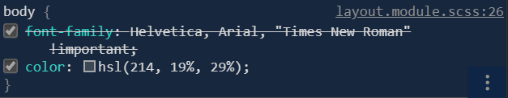

### 14) Trả về giá trị biểu thức cuối cùng của biểu thức.

**$_** sẽ trả về giá trị cuối cùng của biểu thức.

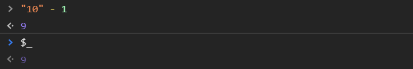