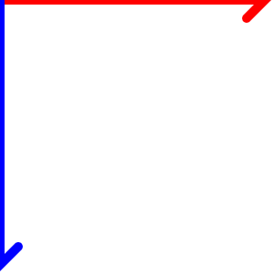
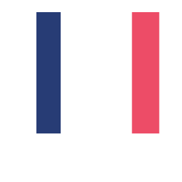

**Canvas** là một phần tử của *HTML5*, có thể trích xuất đồ họa của các đối tượng hai chiều trên trang web. Bạn có biết rằng canvas chiếm một khu vực nhất định trong trang web với chiều rộng và chiều cao đã được định trước, chỉ có thể sử dụng *JavaScript* truy cập vào khu vực này để vẽ thông qua một tập các hàm đồ họa tương tự như API 2D khác.

Liên quan đến bài viết: [Tìm hiểu đồ hoạ Website](/graphic-website/), [Thao tác DOM](/domjs/).

### Bắt đầu nào.

Những kiến thức cơ bản sẽ không được giải thích lại. Tớ chỉ nêu ra những cách thức để dựng một số hình vẽ, vector,... cơ bản nhất. Từ đó có thể áp dụng vào những dự án thực tế.

Trong thẻ `<body></body>` buộc phải khai báo thẻ `<canvas></canvas>`.

```html
    <body>
        <canvas width = "300" height = "300"></canvas>
    </body>
```

***Bạn có biết ?***:
- Trước khi canvas có thể trích xuất đồ họa các đối tượng hai chiều, bạn cần phải xác định **chiều rộng** X **chiều cao** cho trước.
- Nếu không khai báo chiều rộng X chiều dài, mặc định sẽ là **300x150**.
- Thật không may, muốn xác định được khu vực của canvas, không nên khai báo giá trị `px` sau mỗi tham số được định trước, mỗi tham số nên khuyến khích là **số chẵn**. Trên màng hình chỉ hiển thị 1 điểm ảnh, không hiển thị 0.5 điểm ảnh, khi đó mọi thứ đều mờ nhạt và không rõ nét.

### Quan trọng.

Từ mục này trở đi, mọi thứ đều liên quan đến *JavaScript*.

Việc đầu tiên là tạo riêng một tệp tin **main.js** và ***...src="main.js"...*** vào bên trong thẻ `<body></body>`.

```js
    var canvas = document.querySelector('canvas');
    // Sử dụng DOM để lấy thẻ <canvas> đầu tiên mà nó tìm thấy.

    var c = canvas.getContext('2d');
    // Sử dụng đồ họa 2D.
```

### Xác định tọa độ **X**-**Y**.

Tọa độ **X**-**Y** được xác định với điểm xuất phát từ gốc trên cùng bên trái với tọa độ là **(0, 0)**.
Từ điểm đã được xác định, bạn có thể sử 



- `X` có màu đỏ.
- `Y` có màu xanh.

#### 1) Vẽ đường thẳng (Line Canvas).


```js
    c.beginPath();
    c.moveTo(50, 50);
    c.lineTo(250, 250);
    c.stroke();
```

* `beginPath()` : Mở đầu cho mỗi nét vẽ.
* `moveTo()` : Điểm bắt đầu vẽ.
* `lineTo()` : Tạo đường vẽ từ điểm bắt đầu đến điểm cuối.
* `stroke()` : Tạo nét.

#### 2) Vẽ đường dẫn (Subpath Canvas).


```js
    c.beginPath();
    c.moveTo(0, 0);
    c.lineTo(160, 20);
    c.lineTo(210, 150);
    c.closePath();
    c.lineTo(50, 250);
    c.stroke();
```

* Tất nhiên bạn có thể tái sử dụng `.lineTo()` nhiều lần cho các nét vẽ tiếp theo.
* `closePath()` : Nối điểm cuối cùng của nét vẽ cuối* đến điểm bắt đầu nét vẽ.

***Lưu ý !***: 
* Nếu bạn có ý định tạo một nét vẽ mới, nên sử dụng `beginPath()` mới và kết thúc chúng ngay khi dùng `stroke()`, thay vì viết đè như ví dụ trên.

#### 3) Độ rộng nét vẽ (lineWidth).



```js
c.beginPath();
c.moveTo(40, 20);
c.lineTo(40, 220);
c.lineWidth = 40;
c.strokeStyle = '#273c75';
c.stroke();

c.beginPath();
c.moveTo(120, 20);
c.lineTo(120, 220);
c.lineWidth = 45;
c.strokeStyle = '#ED4C67';
c.stroke();
```

* `lineWidth` : Tăng độ rộng cho nét vẽ.
* `strokeStyle` : Màu nét vẽ, có thể là màu **hsl(), rgb(), rgba(), hex...**.

***Lưu ý !***:
* Cột màu **xanh lơ** và cột màu **hồng** có sự khác nhau về đường nét. Canvas không thể chọn 0.5 điểm ảnh cho mỗi bên, vì thế trong canvas đừng nên dùng số lẻ.